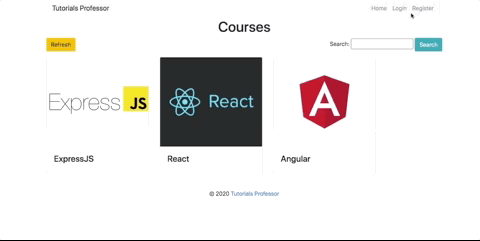
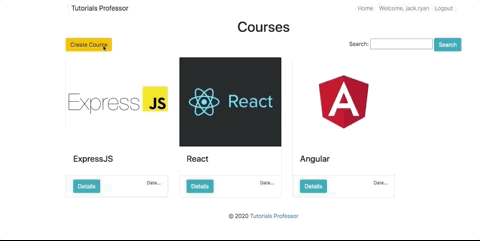
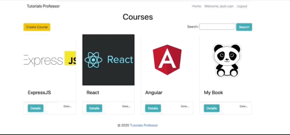

# Tutorial Professor
A online experience that will empower you to change your life through acquisition of additional skills!

    
    
    
    
    
    

    

## Node Required
**********************************************************
### Run 
    npm i

### Create in Root 
    touch .env
 

## Tutorial Professor
**********************************************************

    

### File Structure
    📦tutorial-professor
    ┣ 📂config
    ┃ ┣ 📜config.js
    ┃ ┣ 📜express.js
    ┃ ┗ 📜routes.js
    ┣ 📂controllers
    ┃ ┣ 📜create.js
    ┃ ┣ 📜delete.js
    ┃ ┣ 📜details.js
    ┃ ┣ 📜edit.js
    ┃ ┣ 📜enroll.js
    ┃ ┣ 📜home.js
    ┃ ┣ 📜index.js
    ┃ ┣ 📜login.js
    ┃ ┗ 📜user.js
    ┣ 📂lib
    ┃ ┗ 📜notify.min.js
    ┣ 📂models
    ┃ ┣ 📜Course.js
    ┃ ┣ 📜User.js
    ┃ ┗ 📜index.js
    ┣ 📂scripts
    ┃ ┗ 📜index.js
    ┣ 📂static
    ┃ ┣ 📂css
    ┃ ┃ ┗ 📜site.css
    ┃ ┗ 📜favicon.ico
    ┣ 📂views
    ┃ ┣ 📂layouts
    ┃ ┃ ┗ 📜main.hbs
    ┃ ┣ 📂partials
    ┃ ┃ ┣ 📜footer.hbs
    ┃ ┃ ┗ 📜header.hbs
    ┃ ┣ 📜404.hbs
    ┃ ┣ 📜create.hbs
    ┃ ┣ 📜details.hbs
    ┃ ┣ 📜edit.hbs
    ┃ ┣ 📜index.hbs
    ┃ ┣ 📜login.hbs
    ┃ ┗ 📜register.hbs
    ┣ 📜.env
    ┣ 📜.gitignore
    ┣ 📜LICENSE
    ┣ 📜README.md
    ┣ 📜TODO.js
    ┣ 📜index.js
    ┣ 📜package-lock.json
    ┣ 📜package.json
    ┗ 📜seed.js

### Create User

    

### Create Course

    

### Delete Course

    

